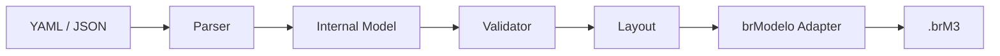

# brmgen

`brmgen` is a small command-line application for turning versionable YAML or JSON conceptual-model definitions into native, editable brModelo desktop `.brM3` files.

The project is under active development. The CLI shell is available; parsing, validation, layout, and native generation are being delivered incrementally. Commands that are not implemented fail explicitly and do not create output.

## Table of Contents

- [About](#about)
- [Features and Status](#features-and-status)
- [Requirements](#requirements)
- [Build](#build)
- [Quick Start](#quick-start)
- [CLI](#cli)
- [Input Format](#input-format)
- [Architecture](#architecture)
- [brModelo Compatibility](#brmodelo-compatibility)
- [Development and Testing](#development-and-testing)
- [Project Structure](#project-structure)
- [Contributing](#contributing)
- [Security](#security)
- [License](#license)

## About

The intended pipeline is:



`brmgen` is not a replacement for brModelo and does not provide a GUI, SQL generation, or browser automation.

## Features and Status

The current development build parses YAML and JSON into its internal model and provides semantic validation through `validate`. Deterministic layout, native generation, and full runtime diagnostics remain tracked work; unavailable commands return a non-zero status.

The first usable release will support entities, attributes, relationships, cardinalities, generalization/specialization, weak and identifying constructs, and explicit or automatic positions.

## Requirements

- A Java runtime capable of launching Gradle 9.1 or newer
- Network access on the first build to resolve the Java 21 toolchain and dependencies
- A compatible local brModelo JAR for native generation and integration tests when those features become available

The Gradle build compiles and tests with Java 21. The Wrapper provisions the toolchain when no matching local JDK is present.

## Build

```bash
./gradlew build
```

The application distribution is created under `build/distributions/`. During development, run the CLI directly:

```bash
./gradlew run --args='version'
```

## Quick Start

Validate the included YAML example:

```bash
./gradlew run --args='validate examples/library.yaml'
```

A valid model prints its normalized input path and exits with status `0`. Syntax, schema, and semantic errors are written to stderr with a non-zero status and stable diagnostic codes.

## CLI

```text
brmgen build <input> [-o <file>] [--brmodelo-jar <jar>]
brmgen validate <input>
brmgen doctor [--brmodelo-jar <jar>]
brmgen version
```

`validate` is functional. Native output from `build` and the full external-JAR inspection performed by `doctor` are not implemented yet.

## Input Format

Every model definition will require schema version `1`. YAML is the primary authoring format and JSON maps to the same internal model.

```yaml
version: 1
diagram:
  name: Library
entities:
  - name: Author
    attributes:
      - name: id
        key: true
      - name: name
```

The parser rejects unknown fields, inputs larger than 2 MiB, excessive nesting, unsupported extensions, and malformed syntax. Semantic validation currently covers schema version, names, references, relationship participation, attributes and flags, weak entities, identifying relationships, generalizations, cardinality presence, and coordinates.

## Architecture

The parser, validator, and layout operate on types owned by `brmgen`. brModelo implementation classes are restricted to a dedicated adapter boundary, keeping normal tests independent of the external application.

## brModelo Compatibility

The initial target is brModelo desktop 3.3.x, with 3.3.2 as the reference version. Compatibility will be verified against a JAR explicitly selected with `--brmodelo-jar` or `BRMODELO_JAR`; `brmgen` will not discover or download arbitrary JARs.

brModelo is a separate GPL-3.0 project. Its source and binaries are not part of, bundled with, or redistributed by this MIT-licensed repository. Users are responsible for obtaining a compatible copy.

## Development and Testing

```bash
./gradlew test
./gradlew spotlessCheck
./gradlew check
```

`check` includes the unit tests and formatting verification. Native integration tests will be isolated from normal tests because they require a user-supplied brModelo JAR.

## Project Structure

```text
.github/       issue templates and CI
src/main/      application code
src/test/      unit and integration-facing tests
examples/      representative model definitions
schemas/       published input schemas
```

Directories are added as their corresponding implementation becomes available.

## Contributing

See [CONTRIBUTING.md](CONTRIBUTING.md) for the issue-driven workflow, branch rules, commit convention, and Definition of Done.

## Security

See [SECURITY.md](SECURITY.md) for private reporting guidance and the trust boundaries around model files, native serialization, and external JARs.

## License

`brmgen` is available under the [MIT License](LICENSE). This license does not apply to brModelo.
