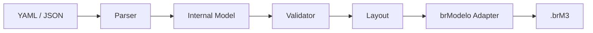

# brmgen

`brmgen` is a small command-line application for turning versionable YAML or JSON model definitions into native, editable brModelo desktop `.brM3` files.

The project is under active development. Parsing, validation, layout, runtime checks, and minimal native generation are available; broader conceptual mapping is being delivered incrementally.

## Table of Contents

- [About](#about)
- [Features and Status](#features-and-status)
- [Requirements](#requirements)
- [Build](#build)
- [Quick Start](#quick-start)
- [CLI](#cli)
- [Input Format](#input-format)
- [Supported Modeling Features](#supported-modeling-features)
- [Architecture](#architecture)
- [brModelo Compatibility](#brmodelo-compatibility)
- [Development and Testing](#development-and-testing)
- [Project Structure](#project-structure)
- [Contributing](#contributing)
- [Security](#security)
- [License](#license)

## About

The intended pipeline is:



`brmgen` is not a replacement for brModelo and does not provide a GUI, SQL generation, or browser automation.

## Features and Status

The current development build parses YAML and JSON, provides semantic validation through `validate`, includes deterministic layout, and generates conceptual or logical `.brM3` files using a user-supplied compatible brModelo JAR. Logical output uses native tables, columns, composite primary-key constraints, foreign-key constraints, and table links.

The first usable release will support entities, attributes, relationships, cardinalities, generalization/specialization, weak and identifying constructs, and explicit or automatic positions.

## Requirements

- A Java runtime capable of launching Gradle 9.1 or newer
- Network access on the first build to resolve the Java 21 toolchain and dependencies
- A compatible local brModelo 3.3.x JAR for native generation and integration tests

The Gradle build compiles and tests with Java 21. The Wrapper provisions the toolchain when no matching local JDK is present.

## Build

```bash
./gradlew build
```

The application distribution is created under `build/distributions/`. During development, run the CLI directly:

```bash
./gradlew run --args='version'
```

## Quick Start

Validate the included YAML example:

```bash
./gradlew run --args='validate examples/library.yaml'
```

A valid model prints its normalized input path and exits with status `0`. Syntax, schema, and semantic errors are written to stderr with a non-zero status and stable diagnostic codes.

Check a local brModelo runtime and generate an example:

```bash
./gradlew run --args='doctor --brmodelo-jar /path/to/brModelo.jar'
./gradlew run --args='build examples/single-entity.yaml --brmodelo-jar /path/to/brModelo.jar'
```

The output defaults to the input path with a `.brM3` extension. Existing files are never overwritten.

## CLI

```text
brmgen build <input> [-o <file>] [--logical] [--brmodelo-jar <jar>]
brmgen validate <input>
brmgen doctor [--brmodelo-jar <jar>]
brmgen version
```

`validate`, `doctor`, and `build` are functional for conceptual and direct logical input. `--brmodelo-jar` takes precedence over `BRMODELO_JAR`.

Use `build --logical` with conceptual input to generate the transformed logical diagram. The initial transformation maps identifiers to primary keys, 1:N relationships to foreign keys on the N side, and N:N relationships to associative tables with composite keys. Relationship attributes follow the FK or associative table. For 1:1, the mandatory participant receives the FK when participation differs; ties use the second declared participant deterministically.

## Input Format

Every model definition requires schema version `1` and an explicit model type. YAML is the primary authoring format and JSON maps to the same internal model. Legacy conceptual inputs using `diagram.name` remain readable.

```yaml
version: 1
model:
  type: conceptual
  name: Library
entities:
  - name: Author
    attributes:
      - name: id
        key: true
      - name: name
```

Logical input uses `type: logical`, tables, columns, structural primary keys, and explicit foreign-key references. A column-level `primaryKey: true` is supported for simple keys; `primaryKey.columns` represents composite keys.

```yaml
version: 1
model:
  type: logical
  name: Library
tables:
  - name: Author
    columns:
      - name: id
        type: integer
        primaryKey: true
  - name: Book
    columns:
      - name: author_id
        type: integer
    foreignKeys:
      - columns: [author_id]
        references:
          table: Author
          columns: [id]
```

The parser rejects unknown fields, inputs larger than 2 MiB, excessive nesting, unsupported extensions, and malformed syntax. Semantic validation currently covers schema version, names, references, relationship participation, attributes and flags, weak entities, identifying relationships, generalizations, cardinality presence, and coordinates.

Optional manual coordinates use non-negative integers:

```yaml
position:
  x: 100
  y: 200
```

Manual positions take precedence. Missing entity positions are assigned on a deterministic grid, while relationships and generalizations are placed relative to their participants.

## Supported Modeling Features

The parser, internal model, validator, and layout support:

- regular and weak entities;
- simple, key, partial-key, composite, multivalued, and derived attributes;
- binary and n-ary relationships with relationship attributes;
- identifying relationships;
- cardinalities `0..1`, `1..1` (and legacy alias `1`), `1..n`, and `0..n`;
- total/partial and disjoint/overlapping generalization data;
- manual and deterministic automatic positions.

All listed features except derived attributes are available to native conceptual `.brM3` mapping. brModelo 3.3.x has no native derived-attribute property, so native generation rejects that flag explicitly instead of discarding it.

## Architecture

The parser, validator, and layout operate on types owned by `brmgen`. brModelo implementation classes are restricted to a dedicated adapter boundary, keeping normal tests independent of the external application.

## brModelo Compatibility

The initial target is brModelo desktop 3.3.x, with 3.3.2 as the reference version. Compatibility will be verified against a JAR explicitly selected with `--brmodelo-jar` or `BRMODELO_JAR`; `brmgen` will not discover or download arbitrary JARs.

brModelo is a separate GPL-3.0 project. Its source and binaries are not part of, bundled with, or redistributed by this MIT-licensed repository. Users are responsible for obtaining a compatible copy.

## Development and Testing

```bash
./gradlew test
./gradlew spotlessCheck
./gradlew check
BRMODELO_JAR=/path/to/brModelo.jar ./gradlew integrationTest
```

`check` includes unit tests and formatting verification. `integrationTest` is separate, requires `BRMODELO_JAR`, generates a native file, deserializes it through the selected runtime, and verifies its entity structure.

## Project Structure

```text
.github/       issue templates and CI
src/main/      application code
src/test/      unit and integration-facing tests
src/integrationTest/ tests requiring a local brModelo JAR
examples/      representative model definitions
schemas/       published input schemas
```

Directories are added as their corresponding implementation becomes available.

## Contributing

See [CONTRIBUTING.md](CONTRIBUTING.md) for the issue-driven workflow, branch rules, commit convention, and Definition of Done.

## Security

See [SECURITY.md](SECURITY.md) for private reporting guidance and the trust boundaries around model files, native serialization, and external JARs.

## License

`brmgen` is available under the [MIT License](LICENSE). This license does not apply to brModelo.
