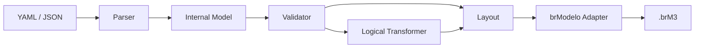

<div align="center">

<h1>brmgen</h1>

<p><strong>Generate editable brModelo conceptual and logical models from structured definitions.</strong></p>

<p>
  <a href="https://github.com/kristyancarvalho/brmgen/actions/workflows/ci.yml"></a>
  <a href="https://github.com/kristyancarvalho/brmgen/releases/latest"></a>
  <a href="LICENSE"></a>
</p>

</div>

`brmgen` turns versionable YAML or JSON definitions into native `.brM3` files that remain editable in brModelo desktop. It supports direct conceptual and logical input and an initial conceptual-to-logical transformation.

## Table of Contents

- [Status](#status)
- [Requirements](#requirements)
- [Installation](#installation)
- [Quick Start](#quick-start)
- [CLI Reference](#cli-reference)
- [Input Format](#input-format)
- [Supported Modeling Features](#supported-modeling-features)
- [Architecture](#architecture)
- [brModelo Compatibility](#brmodelo-compatibility)
- [Development and Testing](#development-and-testing)
- [Project Structure](#project-structure)
- [Contributing](#contributing)
- [Security](#security)
- [License](#license)

## Status

| Stage | Capability |
| --- | --- |
| Implemented | YAML and JSON parsing, validation, deterministic layout, conceptual and logical `.brM3` generation |
| Experimental | Conceptual-to-logical transformation for regular entities and binary 1:1, 1:N, and N:N relationships |
| Planned | Additional transformation rules for weak entities, n-ary relationships, multivalued attributes, and generalizations |

| Feature | Conceptual | Logical |
| --- | --- | --- |
| Entities / tables | Yes | Yes |
| Attributes / columns | Yes | Yes |
| Identifiers / primary keys | Yes | Yes, including composite keys |
| Relationships | Yes | Via foreign keys or associative tables |
| Cardinalities | Yes | Stored on native table links |
| Relationship attributes | Yes | On the foreign-key side or associative table |
| Foreign keys | Not applicable | Yes, with explicit references |
| Manual / automatic layout | Yes | Yes |

`brmgen` is not a replacement for brModelo and does not provide a GUI, SQL generation, or browser automation.

## Requirements

- Java 21 or newer
- A compatible local brModelo 3.3.x JAR for `.brM3` generation
- Network access on the first source build to resolve Gradle and Java dependencies

The brModelo JAR is a separate external dependency. It is not downloaded, bundled, or redistributed by this project.

## Installation

Build an application distribution from source:

```bash
./gradlew installDist
./build/install/brmgen/bin/brmgen --help
```

The archive distributions are written to `build/distributions/` by `./gradlew build`.

Official semantic-version releases provide application archives and SHA-256 checksums on the [GitHub Releases page](https://github.com/kristyancarvalho/brmgen/releases).

### Arch Linux

Until the prepared AUR package receives its initial publication, build the checked-in package definition directly:

```bash
git clone https://github.com/kristyancarvalho/brmgen.git
cd brmgen/packaging/aur
makepkg -si
```

The package installs the CLI and its Java dependencies but does not install or redistribute `brModelo.jar`.

## Quick Start

Validate a model definition:

```bash
./gradlew run --args='validate examples/library.yaml'
```

Check the external runtime and generate conceptual, direct logical, or transformed logical output:

```bash
./gradlew run --args='doctor --brmodelo-jar /path/to/brModelo.jar'
./gradlew run --args='build examples/author-book/conceptual.yaml --brmodelo-jar /path/to/brModelo.jar'
./gradlew run --args='build examples/author-book/logical.yaml --brmodelo-jar /path/to/brModelo.jar'
./gradlew run --args='build examples/author-book/conceptual.yaml --logical -o author-book-logical.brM3 --brmodelo-jar /path/to/brModelo.jar'
```

The output defaults to the input path with a `.brM3` extension. Existing files are never overwritten. `--brmodelo-jar` takes precedence over `BRMODELO_JAR`.

## CLI Reference

| Command | Description |
| --- | --- |
| `brmgen build <input>` | Generate an editable conceptual or logical `.brM3` file |
| `brmgen validate <input>` | Validate a definition without generating output |
| `brmgen doctor` | Check Java and brModelo compatibility |
| `brmgen version` | Print the installed version |

| Option | Commands | Description |
| --- | --- | --- |
| `-h`, `--help` | All | Show command-specific help |
| `-V`, `--version` | All | Print version information |
| `-o`, `--output <file>` | `build` | Select the destination `.brM3` file |
| `--brmodelo-jar <jar>` | `build`, `doctor` | Select a compatible external brModelo JAR |
| `--logical` | `build` | Transform conceptual input before generating logical output |

Use the generated help as the authoritative command reference:

```bash
brmgen --help
brmgen build --help
brmgen validate --help
brmgen doctor --help
```

Input and validation failures use non-zero exit codes and concise diagnostics without normal stack traces.

## Input Format

Every definition requires schema version `1` and an explicit model type. YAML and JSON map to the same internal model.

Conceptual example:

```yaml
version: 1
model:
  type: conceptual
  name: Library
entities:
  - name: Author
    attributes:
      - name: id
        key: true
      - name: name
```

Logical example:

```yaml
version: 1
model:
  type: logical
  name: Library
tables:
  - name: Author
    columns:
      - name: id
        type: integer
        primaryKey: true
  - name: Book
    columns:
      - name: author_id
        type: integer
    foreignKeys:
      - columns: [author_id]
        references:
          table: Author
          columns: [id]
```

Optional manual coordinates use non-negative integers and take precedence over automatic layout:

```yaml
position:
  x: 100
  y: 200
```

The parser rejects unknown fields, unsupported extensions, malformed syntax, inputs larger than 2 MiB, and excessive nesting.

## Supported Modeling Features

Conceptual input supports regular and weak entities; simple, identifier, partial-key, composite, multivalued, and derived attributes; binary and n-ary relationships; relationship attributes; identifying relationships; cardinalities `0..1`, `1..1`, `1..n`, and `0..n`; and total/partial, disjoint/overlapping generalization data.

All listed features except derived attributes map to native conceptual output. brModelo 3.3.x has no native derived-attribute property, so generation rejects that flag instead of silently discarding it.

The initial logical transformation covers regular entities, simple and composite identifier columns, binary 1:1, 1:N, and N:N relationships, and relationship attributes. Unsupported transformation cases fail explicitly while remaining available for direct conceptual generation.

## Architecture



The parser, validator, transformation, and layout use types owned by `brmgen`. brModelo implementation classes stay behind dedicated conceptual and logical adapter boundaries.

## brModelo Compatibility

The reference target is brModelo desktop 3.3.2. Select a compatible JAR with `--brmodelo-jar` or `BRMODELO_JAR`; `brmgen` does not discover or download arbitrary JARs.

brModelo is a separate GPL-3.0 project. Its source and binaries are not part of, bundled with, or redistributed by this MIT-licensed repository. Users are responsible for obtaining a compatible copy.

## Development and Testing

| Command | Purpose |
| --- | --- |
| `./gradlew test` | Run unit and regular integration-facing tests |
| `./gradlew spotlessCheck` | Verify source and documentation formatting |
| `./gradlew check` | Run the normal verification lifecycle |
| `./gradlew build` | Verify and create application distributions |
| `BRMODELO_JAR=/path/to/brModelo.jar ./gradlew integrationTest` | Run native generation and controlled round-trip tests |

Native integration tests deserialize only files generated inside the test run. They remain separate from normal CI because this repository does not redistribute the external JAR.

## Project Structure

| Path | Purpose |
| --- | --- |
| `.github/` | Issue templates and GitHub Actions workflows |
| `examples/` | Representative conceptual and logical definitions |
| `packaging/` | Arch Linux and AUR package definitions |
| `scripts/` | Release-package synchronization utilities |
| `src/main/` | Application source code |
| `src/test/` | Unit and regular integration-facing tests |
| `src/integrationTest/` | Tests requiring an explicitly supplied brModelo JAR |

## Contributing

See [CONTRIBUTING.md](CONTRIBUTING.md) for the issue-driven workflow, branch rules, commit convention, and Definition of Done.

## Security

See [SECURITY.md](SECURITY.md) for private reporting guidance and the trust boundaries around model files, native serialization, releases, and external JARs.

## License

`brmgen` is available under the [MIT License](LICENSE). This license does not apply to brModelo.
